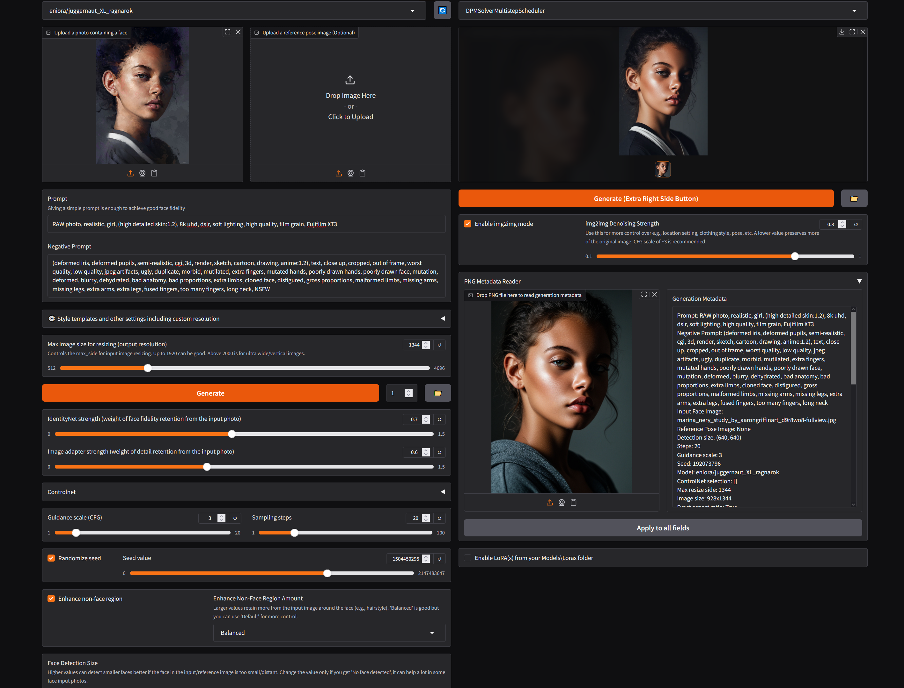

<h1>InstantID: Unlocked. Zero-shot Identity-Preserving Generation</h1>

I think it's worth mentioning that I am not too good with python and the code is full of workarounds/hacks + I used a lot of help from AI chatbots, but at least it works really well and everything is working as I intended with no issues at all. :D

I originally started modifying InstantID for my own usage and to improve my experience and learn a bit more about python, then decided to release it as a fork. Many thanks to the InstantX team for this awesome project!
The code barely follows any DRY principles as it started as a personal modification project to imporve my experience and I slowly fixed/patched stuff over time. So now doing "DRY" on it would require a lot of time and possibly break things.

## This fork adds the following:

🖼️ Output & Metadata
- Autosave of every generated image into an output folder.
- “Open Output Folder” button in the Gradio GUI.
- PNG metadata writing for all autosaved images.
- Metadata reader box in the GUI (load metadata from a PNG and apply it back to all fields).

🎨 Models, LoRAs & Styles
- Model selector dropdown (choose your base SDXL model easily).
- Multiple LoRA loader. Load and combine up to 8 LoRAs with different weights.
- New default model: eniora/RealVisXL_V5.0 (better than YamerMIX). Other good tested models: John6666/albedobase-xl-v31large-sdxl/, ProtoVision XL 6.6, misri/juggernautXL_juggXIByRundiffusion, John6666/cyberrealistic-xl-v58-sdxl.
- Added over 1100 styles, including many from Fooocus and StyleSelectorXL.
- New CN pose model by xinsir, found it a bit better than the original with better colors.

🧠 Control & Generation
- img2img mode integrated directly (no need to run a separate pipeline).
- Negative Prompt Profiles dropdown with many presets (General, Minimalist, Portraits, Realism, Anime, Fooocus, etc.).
- Detection Size selector for face detection in input/reference photos.
- Multiple schedulers available (beyond the original EulerDiscrete).
- VAE tiling option to improve VRAM efficiency.
- Resolution slider up to 4096px.
- Generate multiple images in one run, each with a random seed.

👤 Face Enhancement
- Enhance Non-Face Region with adjustable padding with profiles: Default, Balanced, High, or Custom padding amount.

⚡ Performance
- Tweaks to improve VRAM usage compared to the original repo. Runs good on 12GB VRAM but 16GB+ is recommended.
- Works on 8GB GPUs, but expect very slow generations (~15 minutes for 1280×960).

And many many more improvements.

I tried the most popular forgeui and comfyui implementations including the popular cubiq/ComfyUI_InstantID and it's really bad compared to my gradio fork of InstantID. cubiq/ComfyUI_InstantID (which was the best from the comfy implementations I tried) tends to screw up the faces and similarity sometimes no matter what options and workflows I tried, and the multi ID feature doesn't work well anyway and is overly complicated (even the author admits this). Try this and judge for yourself. I agree that comfyui instantid is faster but the quality isn't so good really. The good thing about cubiq/ComfyUI_InstantID is the stylization with "IP-Adapter plus VIT", I've been trying to make it work with this fork but I always failed, guess I am not skilled enough for this. :>

## How to use and run:

git clone https://github.com/eniora/InstantID-Unlocked

cd InstantID-Unlocked

python -m venv venv

venv\Scripts\activate

pip install -r requirements.txt

pip install torch==2.7.1+cu128 torchvision==0.22.1+cu128 --index-url https://download.pytorch.org/whl/cu128

python instant-id-unlocked.py

_______________________________________________
- For downloading the necessary models: face encoder models, controlnet models and IPAdatper etc. I uploaded all the necesseray files here:
https://drive.google.com/file/d/1NhEAXql1kuekE8GGOUvQSsHgm_twvQYq/view?usp=sharing
This is my whole models and checkpoints folder except for the SDXL model(s).
Just download the file, extract it and copy the folders into your root InstantID folder. Then you will only need an SDXL model to start generating. It will be downloaded automatically from huggingface when you start InstantID.
- If you want my "site-packages" folder for the venv, here it is: https://drive.google.com/file/d/17OgQBmNvHZdygONCzRSuaYmec5uW1hxT/view?usp=sharing
Create a venv ("python -m venv venv") and then just copy the "site-packages" folder from the archive to "\venv\Lib\". If you do this and use my "site-packages" folder, you don't need to install the requirements.txt or torch/nvidia cuda or anything.

Tested only on Windows and Python 3.10.6 and Nvidia GPUs, you may need to do extra steps to run the gradio interface successfully on MacOS/Linux or if you have an AMD GPU.

Here's a quick preview of the fork: (This is one of hundreds ways to generate different images with this fork, for example you can add a LoRA or multiple loras with different weights, or try without img2img, or try different styles, or try different models, or etc.)

_______________________________________________
InstantX Credits:

[**Qixun Wang**](https://github.com/wangqixun)12 · [**Xu Bai**](https://huggingface.co/baymin0220)12 · [**Haofan Wang**](https://haofanwang.github.io/)12* · [**Zekui Qin**](https://github.com/ZekuiQin)12 · [**Anthony Chen**](https://antonioo-c.github.io/)123

Huaxia Li2 · Xu Tang2 · Yao Hu2

1InstantX Team · 2Xiaohongshu Inc · 3Peking University

*corresponding authors

 

InstantID is a new state-of-the-art tuning-free method to achieve ID-Preserving generation with only single image, supporting various downstream tasks.

