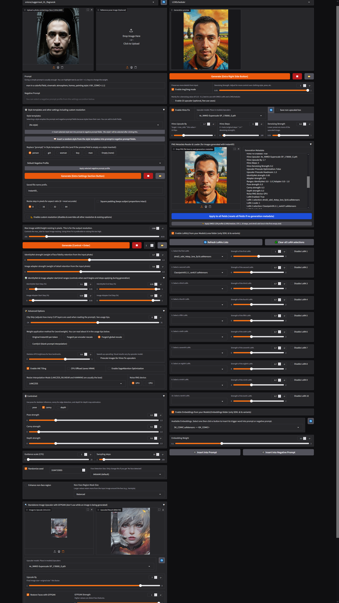

<h1>InstantID Unlocked</h1>

I think it's worth mentioning that I am not too good with python and the code is full of workarounds/hacks + I used a lot of help from AI chatbots, but at least it works really well and everything is working as I intended with no issues at all. While I get a lot of help from chatbots, this is really not vibe coded and I still do lots of stuff manually and I try to fix all issues I find.

I originally started modifying InstantID for my own usage and to improve my experience and learn a bit more about python, then decided to release it as a fork. Many thanks to the InstantX team for this awesome project!
The code barely follows any DRY principles as it started as a personal modification project to improve my experience and I slowly fixed/patched stuff over time. So now doing "DRY" on it would require a lot of time and possibly break things (I am not too good for doing a DRY on it, and I wouldn't trust an AI chatbot to do it for me without screwing up something as the app has a million different features and most of them rely on each other).

## This fork adds the following:

🖼️ Output & Metadata
- Autosave of every generated image into an output folder.
- “Open Output Folder” button in the Gradio GUI.
- PNG metadata writing for all autosaved images.
- Metadata reader box in the GUI (load metadata from a PNG and apply it back to all fields).

🎨 Models, LoRAs, Embeddings & Styles
- Model selector dropdown (choose your base SDXL model easily).
- Multiple LoRA loader. Load and combine up to 8 LoRAs with different weights.
- Embeddings loader with a dropdown menu to insert to prompt or negative prompt.
- New default model: eniora/Juggernaut_XL_Ragnarok (better than YamerMIX). Other good tested models: John6666/albedobase-xl-v31large-sdxl/, eniora/RealVisXL_V5.0, ProtoVision XL 6.6, misri/juggernautXL_juggXIByRundiffusion, John6666/cyberrealistic-xl-v58-sdxl.
- Added over 1100 styles, including many from Fooocus and StyleSelectorXL.
- New CN pose model by xinsir, found it a bit better than the original with better colors.
- In addition to the default diffusers format support for loading checkpoints, I added the ability to load single SDXL, Pony and Illustrious .safetensors files. They will automatically appear in the model dropdown selection menu when placed in the /models folder.

🧠 Control & Generation
- Real Multi-ID support. Better than any other implementation including the one in cubiq/ComfyUI.
- img2img mode integrated directly (no need to run a separate pipeline).
- Ability to add more reference face images, it averages the face embeddings from multiple images into a single identity for generation. Meaning you can add more photos of the same person to improve likeness and consistency. Or mix in photos of different people to blend their faces into one morphed identity.
- Negative Prompt Profiles dropdown with many presets (General, Minimalist, Portraits, Realism, Anime, Fooocus, etc.).
- Detection Size selector for face detection in input/reference photos.
- Hires Fix support with upscaler drop down menu.
- Multiple schedulers available (beyond the original EulerDiscrete).
- VAE tiling option to improve VRAM efficiency.
- Resolution (max_side) slider up to 8192px.
- Sliders for start/end control step for IdentitiyNet and Image adapter with smooth fractional step blending.
- Weight application method: added UI options to mimic how ForgeUI/A1111 or ComfyUI deal with (word:weight).
- Generate multiple images in one run, each with a random seed.
- Stop button.

👤 Face Enhancement
- Enhance Non-Face Region with adjustable padding with profiles: Default, Balanced, High, or Custom padding amount. Now also works with the img2img pipeline.

⚡ Performance
- Tweaks to improve VRAM usage compared to the original repo. Runs good on 12GB VRAM but 16GB+ is recommended.
- Works on 8GB GPUs, but expect slow generations (~5 minutes for 1280×960). Using LCM with dmd2 lora is highly recommended and I actually find myself using it often even with a beast GPU.
- The minimum requirements for acceptable experience from what I tested is: Any Nvidia RTX with 12GB VRAM and 32GB system memory (RAM). For a very good experience you need 16GB+ VRAM with 64GB RAM.

And many many more improvements and features such as a Standalone Image Upscaler with GFPGAN.

I tried the most popular ForgeUI and ComfyUI implementations including the popular cubiq/ComfyUI_InstantID and InstantID Unlocked is at least on par with them if not better. cubiq/ComfyUI_InstantID (which was the best from the comfy implementations I tried) tends to screw up the faces and similarity a bit sometimes no matter what options and workflows I tried. Try this fork and judge for yourself.

## How to use and run:

git clone https://github.com/eniora/InstantID-Unlocked

cd InstantID-Unlocked

python -m venv venv

venv\Scripts\activate

pip install -r requirements.txt

pip install torch==2.13.0+cu132 torchvision==0.28.0+cu132 --index-url https://download.pytorch.org/whl/cu132

python instant-id-unlocked.py

python 3.12.6 is now supported (also tested and works on python 3.10.6, same requirements.txt file)

Necessary models if you're having trouble manually downloading them (except for the SDXL default model): https://drive.google.com/file/d/1ktwtNay39-6MAZbnrF5RpIlTBm8UbHu3/view?usp=sharing
_______________________________________________
Tested only on Windows 10/11 and Python versions 3.10.6 and 3.12.6 and Nvidia GPUs, you may need to do extra steps to run successfully on MacOS/Linux or if you have an AMD GPU.

Here's a quick preview of the fork: (This is one of hundreds ways to generate different images with this fork, for example you can add a LoRA or multiple loras with different weights, or try with and without img2img, or try different styles, or try different models, or try with embeddings, etc.)

_______________________________________________
InstantX Credits:

[**Qixun Wang**](https://github.com/wangqixun)12 · [**Xu Bai**](https://huggingface.co/baymin0220)12 · [**Haofan Wang**](https://haofanwang.github.io/)12* · [**Zekui Qin**](https://github.com/ZekuiQin)12 · [**Anthony Chen**](https://antonioo-c.github.io/)123

Huaxia Li2 · Xu Tang2 · Yao Hu2

1InstantX Team · 2Xiaohongshu Inc · 3Peking University

*corresponding authors

 

InstantID is a new state-of-the-art tuning-free method to achieve ID-Preserving generation with only single image, supporting various downstream tasks.
